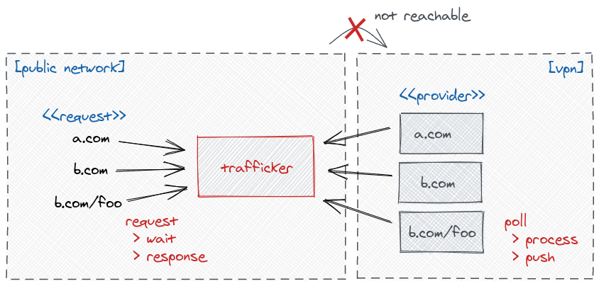

# Trafficker



## Quick start

```json
{
  "gateway": [
    {
      "port": 3000,
      "defaultWaitingTimeout": 6000,
      "defaultWaiterTimeout": 30000,
      "stat": true
    }
  ],
  "proxy": [
    {
      "routes": ["*"],
      "gatewayAddress": "http://localhost:3000",
      "targetAddress": "http://localhost:8080",
      "agentCount": 4,
      "errorSleepMillis": {
        "min": 1000,
        "max": 2000
      },
      "emptySleepMillis": {
        "min": 1000,
        "max": 5000
      },
      "stat": {
        "port": 3100
      }
    }
  ],
  "admin": {
    "port": 4000,
    "shutdownSecret": "very-secret-key"
  }
}
```

```bash
yarn start config.json
```

## License

MIT
